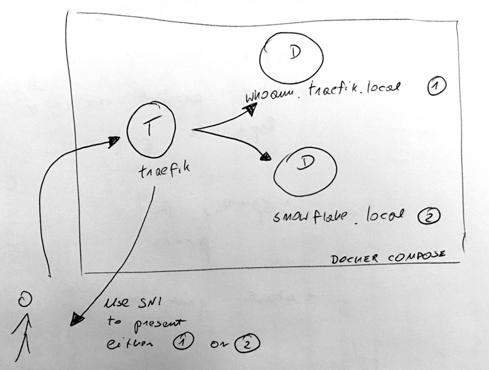

# Traefik TLS Demo

This is a demo project which shows how to use [traefik](https://traefik.io/) to terminate https connection to a docker container.

We use trafik 1.7, as 2.0 is in alpha version at the time of writing.


## Overview



We use docker compose to spin two backend services: `whoami`, `snowflake` and `traefik` to act as a reverse proxy -- it accepts requests at its entrypoints and routes them to the correct backends.

`whoami` and `snowflake` use [whoami](https://github.com/containous/whoami) as a toy server example. They are connected to `traefik` docker network.

Traefik uses docker auto-discovery to find the two services. We use docker labels to register them under unique domains -- `whoami.traefik.local` and `snowflake.traefik.local`.

Traefik exposes two ports (*entrypoints* in traefik lingo) -- http `:80` and https `:443`. Any request over http will result in a redirect to https.

Requests are routed to the respective backends depending on the host -- `whoami.traefik.local` or `snowflake.traefik.local`. If none of the hosts are applicable traefik returns 404.

Each backend service has its own certificate for its unique domian -- `whoami.traefik.local` or `snowflake.traefik.local` -- no wildcards matching both. We use [Server Name Indication (SNI)](https://dzone.com/articles/what-is-sni-server-name-indication-how-does-it-wor) to select the right certificate depending on the host.

In our case the certificates are statically configured in `traefik.toml` file, but in a real world we could use the [file provider](https://docs.traefik.io/configuration/entrypoints/#dynamic-certificates) to add/remove them while traefik is running.


## Usage

### Prerequisites

####`/etc/hosts`

Add the following lines to `/etc/hosts` to make sure they route to localhost:
``` 
127.0.0.1	whoami.traefik.local
127.0.0.1	snowflake.traefik.local
```

`make prerequistes` validates if `/etc/hosts` are setup correctly.

```sh 
$ make prerequistes 
Please add "127.0.0.1       whoami.traefik.local" to /etc/hosts
Please add "127.0.0.1       snowflake.traefik.local" to /etc/hosts
```

#### Generate certificates

`make prerequistes` generates the service certificates if not generated yet.

```sh
$ make prerequistes
(...)
$ tree certs/
certs/
├── snowflake.crt
├── snowflake.key
├── whoami.crt
└── whoami.key
```

### Start up

You can start up either in forground or in background:
```sh
# In foreground
$ make fg
(...) lots of output
```

```sh
# In background
$ make up
Creating network "traefik" with the default driver
Creating whoami                     ... done
Creating traefik-tls-demo_traefik_1 ... done
Creating snowflake                  ... done
```


Tear down:
```sh 
$ make down
Stopping snowflake                  ... done
Stopping traefik-tls-demo_traefik_1 ... done
Stopping whoami                     ... done
Removing snowflake                  ... done
Removing traefik-tls-demo_traefik_1 ... done
Removing whoami                     ... done
Removing network traefik
```

`make up` and `make down` goals are idempotent:

```sh 
$ make up
Creating network "traefik" with the default driver
Creating traefik-tls-demo_traefik_1 ... done
Creating whoami                     ... done
Creating snowflake                  ... done

$ make up
traefik-tls-demo_traefik_1 is up-to-date
whoami is up-to-date
snowflake is up-to-date

$ make down
Stopping snowflake                  ... done
Stopping whoami                     ... done
Stopping traefik-tls-demo_traefik_1 ... done
Removing snowflake                  ... done
Removing whoami                     ... done
Removing traefik-tls-demo_traefik_1 ... done
Removing network traefik

$ make down
Removing network traefik
WARNING: Network traefik not found.

```


### Experiment

Http should redirect to https:

```sh
$ curl -v http://whoami.traefik.local
(...)
< HTTP/1.1 302 Found
< Location: https://whoami.traefik.local:443/
```

Traefik should present the certificate we generated earlier on https connections. Since this is a self-signed cert we need to use `--insecure`.

```sh 
$ curl --insecure -v https://whoami.traefik.local
(...)
* Server certificate:
*  subject: CN=whoami.traefik.local
*  start date: May  8 21:44:13 2019 GMT
*  expire date: May  5 21:44:13 2029 GMT
*  issuer: CN=whoami.traefik.local
*  SSL certificate verify result: self signed certificate (18), continuing anyway.
(...) 
Hostname: 1e8018f3d6a0
IP: 127.0.0.1
IP: 192.168.144.2
GET / HTTP/1.1
Host: whoami.traefik.local
User-Agent: curl/7.64.0
Accept: */*
Accept-Encoding: gzip
X-Forwarded-For: 192.168.144.1
X-Forwarded-Host: whoami.traefik.local
X-Forwarded-Port: 443
X-Forwarded-Proto: https
X-Forwarded-Server: 267b6b087334
X-Real-Ip: 192.168.144.1 
```

#### SNI

Traefik will present different certificate depending on the host we use to connect to it. Compare the previous output with `snowflake`:

```sh 
$ curl --insecure -v https://snowflake.traefik.local
(...)
* Server certificate:
*  subject: CN=snowflake.traefik.local
*  start date: May  8 21:44:13 2019 GMT
*  expire date: May  5 21:44:13 2029 GMT
*  issuer: CN=snowflake.traefik.local
*  SSL certificate verify result: self signed certificate (18), continuing anyway.
```

We use [`sniStrict`](https://docs.traefik.io/configuration/entrypoints/#strict-sni-checking) option as it seems better to terminate connection with clients not supporting SNI, instead of present them with some default certificate which likely won't match the domain they are requesting. 

### Test

If you play with the traefik config it is useful to make sure that nothing is broken. We provide a [simple bash test](./tests/verify-certs.bats) which verifies the certificates subjects presented by the backend services.

The `make test` goal will take care of verifying the prerequistes and (re)starting the services.

```sh
$ make test
Removing network traefik
WARNING: Network traefik not found.
Creating network "traefik" with the default driver
Creating whoami                     ... done
Creating traefik-tls-demo_traefik_1 ... done
Creating snowflake                  ... done
 ✓ whoami.trafik.local presents correct certificate
 ✓ snowflake.trafik.local presents correct certificate

2 tests, 0 failures
Stopping snowflake                  ... done
Stopping whoami                     ... done
Stopping traefik-tls-demo_traefik_1 ... done
Removing snowflake                  ... done
Removing whoami                     ... done
Removing traefik-tls-demo_traefik_1 ... done
Removing network traefik
```


## Discussion

### Do we really need `/etc/hosts` entries?

Can we do `curl -H 'whoami.traefik.local' localhost:80` instead of `curl whoami.traefik.local`?

We could, in case we supported only http or *classic* https. As per rules we've defined, traefik uses `Host` header to select the backend service. If not `Host` header is given, curl will use the request domain name instead, so both options yield the same results.

We need `curl https://whoami.traefik.local` due to SNI -- the right certificate is selected during TLS negotiation, after `ClientHello` message. At this point the http headers are not even transmitted. 
